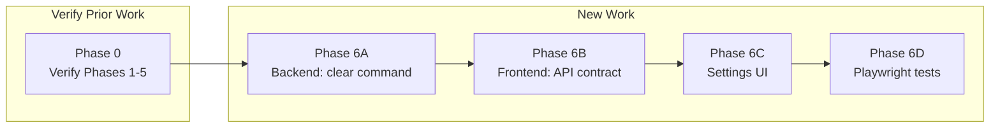

# Memoria AI Grouping Pipeline Enhancement -- Revised Plan

## Executive Summary

This plan covers the full AI grouping pipeline enhancement for Memoria: stricter prompting, schema validation, two-pass AI analysis, fallback model routing, observability, collision handling, and **now** Settings UI changes. Backend primitives (Phases 1-5) were implemented in a prior session and are present in the codebase; they need verification (cargo test + code spot-checks) before building on top of them. The remaining work is:

- Verifying Phases 1-5 backend implementation (cargo test, code inspection)
- Exposing all 5 model configuration slots in the Settings UI
- Aligning the frontend TypeScript contracts with the backend's richer `AiTaskModels` struct
- Adding a `clear_ai_task_model` backend command for unsetting optional models
- Comprehensive testing (unit, integration, Playwright UI)

## What Changed From the Previous Plan

- **Settings UI is now in scope.** The previous plan was backend-only. The revised plan adds a dedicated Settings UI phase.
- **Date estimation fallback** is confirmed in scope. Implemented in backend (needs verification); needs UI exposure.
- **Separate Pass-1 model config** is confirmed. Implemented in backend (`groupingPass1` slot, needs verification); needs UI exposure.
- `**grouping_threshold_days` cleanup** is confirmed in scope. Code in `event_grouper.rs` reads the setting (needs verification).
- **New backend command needed:** `clear_ai_task_model` to unset optional models (no such command exists today).
- **Phase ordering updated:** Verification first, then backend additions, then frontend. Settings UI is a final phase layered on top of stable contracts.
- `**grouping_threshold_days` UI exposure** is explicitly out of scope for this effort unless added later.

## Confirmed Decisions (Not Reopened)

1. `grouping_threshold_days` cleanup is INCLUDED in backend scope. The grouper reads the DB setting; default is `2`.
2. Fallback support applies to BOTH `eventNaming` and `dateEstimation`. Both are in `AiRoutingConfig`.
3. Pass-1 has its own optional model config (`groupingPass1`), separate from Pass-2 (`eventNaming`).
4. `is_holiday_cluster()` remains a guardrail in Phases 1-3; high-confidence AI override is Phase 5 only.
5. Finalize remains non-destructive copy to `/organized/<year>/<year - event>/`.
6. Folder naming format: `YYYY - OptionalLocation EventName`. No full dates. Omit location if unreliable.
7. `grouping_threshold_days` UI exposure is OUT OF SCOPE for this effort.

## Current Implementation Status

### Backend Phases 1-5 (Needs Verification)

Backend changes from the previous plan were implemented in a prior session. That session reported `cargo test` passing (57 passed, 0 failed), but this has **not been independently verified** in the current session. Phase 0 will confirm.

**Key files expected to contain prior-session changes:**

- [src-tauri/src/services/ai_client.rs](src-tauri/src/services/ai_client.rs) -- `AiRoutingConfig` (5 slots), `EventNameSuggestion`, `ClusterMetadata`, two-pass prompts, validation, fallback routing, prompt version constants
- [src-tauri/src/services/event_grouper.rs](src-tauri/src/services/event_grouper.rs) -- reads `grouping_threshold_days`, two-pass orchestration, collision detection, audit logging, holiday guardrail
- [src-tauri/src/db/mod.rs](src-tauri/src/db/mod.rs) -- 11 `ensure_column` calls for AI metadata on `event_groups`
- [src-tauri/src/commands/settings.rs](src-tauri/src/commands/settings.rs) -- `AiTaskModels` with 5 slots, `set_ai_task_model` accepts 5 task names, `get_app_configuration` returns all 5
- [src-tauri/src/main.rs](src-tauri/src/main.rs) -- `ai_client()` loads all 5 model configs from DB

**Verification checklist (Phase 0):**

- Run `cargo test` and capture output
- Confirm `AiRoutingConfig` has all 5 slots
- Confirm `set_ai_task_model` match arm handles all 5 task names
- Confirm `event_grouper::run()` reads `grouping_threshold_days` from DB
- Confirm `ensure_column` calls exist for all 11 AI metadata columns
- Confirm prompt version constants exist (`EVENT_NAMING_PROMPT_VERSION`, `CLUSTER_METADATA_PROMPT_VERSION`)

### Not Yet Implemented (Frontend Gap)

The backend returns all 5 model slots, but the frontend only consumes 2:

- **[src/lib/api.ts](src/lib/api.ts) line 24-31:** `AppConfiguration.aiTaskModels` only declares `dateEstimation` and `eventNaming`. The 3 optional slots (`dateEstimationFallback`, `eventNamingFallback`, `groupingPass1`) are returned by the backend but silently dropped.
- **[src/lib/api.ts](src/lib/api.ts) line 69-75:** `setAiTaskModel` task union is `"dateEstimation" | "eventNaming"`. Backend accepts 5 values.
- **[src/App.tsx](src/App.tsx) line 166-169:** `aiModels` state only tracks 2 models.
- **[src/App.tsx](src/App.tsx) line 1279-1312:** Settings UI renders only 2 `ModelSelector` instances.
- **No `clearAiTaskModel` function exists** in frontend or backend -- optional models cannot be unset once configured.

## Revised Phase Structure




Phase 0: Verify prior backend work. Phases 6A-6D: New work (frontend + clear command), broken into 4 sub-phases for incremental delivery.

---

## Phase 0: Verify Backend Phases 1-5

### Objective

Confirm that prior-session backend work is intact and passing before building on top of it.

### Actions

1. Run `cargo test` in `src-tauri/` and capture output (pass/fail count)
2. Spot-check key structures exist:
  - `AiRoutingConfig` has 5 fields (`date_estimation`, `date_estimation_fallback`, `event_naming`, `event_naming_fallback`, `grouping_pass1`)
  - `set_ai_task_model` match arm handles 5 task names
  - `event_grouper::run()` reads `grouping_threshold_days` from settings DB
  - `ensure_column` calls exist for all 11 AI metadata columns in `db/mod.rs`
  - Prompt version constants exist (`EVENT_NAMING_PROMPT_VERSION`, `CLUSTER_METADATA_PROMPT_VERSION`)
3. Report findings with actual captured output

### Definition of done

- `cargo test` passes with captured output
- All spot-checks confirmed
- Any discrepancies documented and addressed before proceeding

### Status: planned, not yet attempted

---

## Phase 6A: Backend -- Add `clear_ai_task_model` Command

### Objective

Allow the frontend to unset optional model configs so users can revert fallback/pass-1 models to "unconfigured."

### Files involved

- [src-tauri/src/commands/settings.rs](src-tauri/src/commands/settings.rs)

### Backend changes

Add a new Tauri command `clear_ai_task_model(task: String)`:

- Valid task names: `"dateEstimationFallback"`, `"eventNamingFallback"`, `"groupingPass1"`
- Must NOT accept `"dateEstimation"` or `"eventNaming"` (required models cannot be cleared)
- Deletes both the `_provider` and model keys from the `settings` table using the existing `clear_setting_if_exists` helper (line 302)
- Stamps `last_settings_write_ts`

Register the new command in `main.rs` invoke handler.

### Schema/data changes

None.

### Tests to add (planned)

- Unit test: clearing `"eventNamingFallback"` removes both DB keys; subsequent `read_optional_task_model` returns `None`
- Unit test: clearing `"dateEstimation"` returns an error (required model)
- Unit test: clearing a nonexistent task name returns an error

### Manual validation

- Set a fallback model via `set_ai_task_model`, verify it appears in `get_app_configuration`, clear it via `clear_ai_task_model`, verify it returns `null`

### Risks

- Minimal. Uses existing `clear_setting_if_exists` helper. Additive command.

### Rollback

- Remove the command. Optional models stay set once configured (user can overwrite but not clear).

### Definition of done

- `clear_ai_task_model` command works for all 3 optional task names
- Required task names are rejected
- `cargo test` passes

---

## Phase 6B: Frontend -- API Contract Alignment

### Objective

Update TypeScript types and API functions to match the backend's 5-slot `AiTaskModels` contract.

### Files involved

- [src/lib/api.ts](src/lib/api.ts)

### Frontend changes

**1. Update `AppConfiguration` interface (line 24-31):**

```typescript
export interface TaskModelSelection {
  provider: string;
  model: string;
}

export interface AppConfiguration {
  workingDirectory: string;
  outputDirectory: string;
  aiTaskModels: {
    dateEstimation: TaskModelSelection;
    dateEstimationFallback: TaskModelSelection | null;
    eventNaming: TaskModelSelection;
    eventNamingFallback: TaskModelSelection | null;
    groupingPass1: TaskModelSelection | null;
  };
}
```

**2. Expand `setAiTaskModel` task union (line 69-75):**

```typescript
export type AiTaskName =
  | "dateEstimation"
  | "dateEstimationFallback"
  | "eventNaming"
  | "eventNamingFallback"
  | "groupingPass1";

export function setAiTaskModel(
  task: AiTaskName,
  provider: "openai" | "anthropic",
  model: string
) { ... }
```

**3. Add `clearAiTaskModel` function:**

```typescript
export type OptionalAiTaskName =
  | "dateEstimationFallback"
  | "eventNamingFallback"
  | "groupingPass1";

export function clearAiTaskModel(task: OptionalAiTaskName) {
  return invokeCommand<void>("clear_ai_task_model", { task });
}
```

### Tests to add (planned)

- Verify `getAppConfiguration` returns all 5 model slots with correct types
- Verify `setAiTaskModel` accepts all 5 task names
- Verify `clearAiTaskModel` accepts only the 3 optional task names

### Risks

- The backend already returns the 3 optional fields. TypeScript will now consume them. No breaking change.

### Rollback

- Revert the type changes. Frontend silently ignores extra fields from backend.

### Definition of done

- TypeScript types match backend contract
- All 5 task names are usable from frontend code
- `clearAiTaskModel` function is available
- No TypeScript errors

---

## Phase 6C: Settings UI -- Model Configuration

### Objective

Expand the Settings UI to display and configure all 5 model slots with clear, unambiguous labels and visual grouping.

### Files involved

- [src/App.tsx](src/App.tsx) -- Settings section (lines 1279-1312), `aiModels` state (lines 166-169), `ModelSelector` component (lines 3065-3101)
- [src/styles.css](src/styles.css) -- Settings area styles (lines 477-548)

### UX Design

The AI Task Models section will be reorganized into **two visual sub-groups**, each with a clear heading:

**Sub-group 1: Date Estimation**

- Date Estimation -- Primary Model (required)
- Date Estimation -- Fallback Model (optional, clearable)

**Sub-group 2: Event Grouping**

- Grouping Pass 1 -- Cluster Analysis Model (optional, clearable)
- Grouping Pass 2 -- Event Naming Model (required)
- Event Naming -- Fallback Model (optional, clearable)

### Locked-down UI labels

These are the exact labels to use, not to be paraphrased:

- **Date Estimation -- Primary Model**
- **Date Estimation -- Fallback Model**
- **Grouping Pass 1 -- Cluster Analysis Model**
- **Grouping Pass 2 -- Event Naming Model**
- **Event Naming -- Fallback Model**

Each model selector shows:

- The label above
- A provider dropdown (`OpenAI` / `Anthropic`)
- A model name text input
- For optional models: an "(Optional)" tag after the label and a "Clear" button when configured
- Unconfigured optional models display disabled inputs with "Not configured" placeholder and a "Configure" button

### Detailed UI layout

```
AI Task Models
├── Date Estimation
│   ├── Date Estimation — Primary Model          [Anthropic ▼] [claude-sonnet-4-6]
│   └── Date Estimation — Fallback Model (Optional)  [Not configured] [Configure]
│                              -- or when configured --
│   └── Date Estimation — Fallback Model (Optional)  [OpenAI ▼] [gpt-4o] [Clear]
│
├── Event Grouping
│   ├── Grouping Pass 1 — Cluster Analysis Model (Optional)  [Not configured] [Configure]
│   ├── Grouping Pass 2 — Event Naming Model     [Anthropic ▼] [claude-sonnet-4-6]
│   └── Event Naming — Fallback Model (Optional)  [Not configured] [Configure]
│
└── [Save AI Models]
```

### State management changes

Update `aiModels` state in App.tsx to track all 5 slots:

```typescript
const [aiModels, setAiModels] = useState<{
  dateEstimation: { provider: string; model: string };
  dateEstimationFallback: { provider: string; model: string } | null;
  eventNaming: { provider: string; model: string };
  eventNamingFallback: { provider: string; model: string } | null;
  groupingPass1: { provider: string; model: string } | null;
}>({
  dateEstimation: { provider: "anthropic", model: "claude-sonnet-4-6" },
  dateEstimationFallback: null,
  eventNaming: { provider: "anthropic", model: "claude-sonnet-4-6" },
  eventNamingFallback: null,
  groupingPass1: null,
});
```

Hydrated from `getAppConfiguration()` response at line 229-232.

### ModelSelector component changes

Keep changes minimal. The existing `ModelSelector` already accepts `label`, `testPrefix`, `value`, `onChange`. Add only what is necessary for optional model support:

- New prop: `optional?: boolean` -- when true, enables "Not configured" / "Clear" behavior
- New prop: `onClear?: () => void` -- called when user clicks Clear (only rendered when `optional` is true and value is non-null)
- When `value` is `null` and `optional` is true: render disabled provider/model inputs with "Not configured" placeholder and a "Configure" button that initializes to `{ provider: "anthropic", model: "" }`
- When `value` is non-null and `optional` is true: render normally plus a "Clear" button
- Do NOT extract sub-components, create wrapper components, or add configuration objects. Keep it as a single function component with conditional rendering.

Add stable `data-testid` attributes per workspace rules:

- `model-selector-date-estimation-fallback`
- `model-selector-event-naming-fallback`
- `model-selector-grouping-pass1`
- `model-configure-{testPrefix}` for the Configure button
- `model-clear-{testPrefix}` for the Clear button

### Save logic changes

The Save button handler (line 1297-1306) must:

- Call `setAiTaskModel` for each configured model (required models always, optional models only if non-null)
- Call `clearAiTaskModel` **only** for optional slots that were previously configured (non-null in the last-loaded config) and are now null. Do NOT clear every null slot on every save -- track the "last saved" state and diff against it.
- Show status feedback while saving (per workspace rules: "guard async UI actions with clear status messaging")

To implement the diff: store a `savedAiModels` ref (or state) that captures the config as returned by `getAppConfiguration()`. On save, compare each optional slot: if `savedAiModels.X !== null && aiModels.X === null`, call `clearAiTaskModel`. After successful save, update `savedAiModels` to match the current state.

### CSS changes

Add minimal new styles in [src/styles.css](src/styles.css):

- `.settingsSubgroupTitle` -- a slightly smaller/lighter heading for "Date Estimation" and "Event Grouping" sub-groups
- `.settingsModelUnconfigured` -- muted styling for the "Not configured" placeholder state
- `.settingsModelClearBtn` -- inline clear button styling (small, secondary appearance)

### Backward compatibility

Users who have only configured `dateEstimation` and `eventNaming` (the existing two) will see:

- Their existing models populated in the required fields
- All three optional fields showing "Not configured"
- No behavior change until they configure optional models

### Tests to add (planned)

- Verify all 5 model selectors render with correct labels
- Verify optional models show "Not configured" when null
- Verify "Configure" button enables editing
- Verify "Clear" button resets to null
- Verify Save persists all 5 slots correctly

### Manual validation

- Open Settings, verify 5 model selectors visible with correct labels
- Configure a fallback model, save, reload -- verify persisted
- Clear a fallback model, save, reload -- verify cleared
- Verify required models cannot be cleared (no Clear button shown)
- Verify grouping still works after changing Pass 1 model

### Risks

- Risk: UI gets cluttered. Mitigation: Sub-group headings and the unconfigured collapsed state keep it clean.
- Risk: Users confused by 5 model slots. Mitigation: Labels are explicit about stage/purpose; optional models start unconfigured.

### Rollback

- Revert UI to show only 2 model selectors. Backend continues to work with the 3 optional models unconfigured (None).

### Definition of done

- All 5 model selectors visible in Settings
- Optional models can be configured, saved, cleared
- Labels are unambiguous
- Backward compatible for existing users
- All `data-testid` attributes present

---

## Phase 6D: Playwright Tests for Settings

### Objective

Add browser UI tests covering the expanded Settings model configuration.

### Files involved

- [tests/ui/helpers/browserMock.ts](tests/ui/helpers/browserMock.ts) -- update mock `get_app_configuration` to return all 5 slots; add `clear_ai_task_model` mock handler
- New or extended test file under `tests/ui/browser/` for settings

### Tests to add (planned)

- All 5 model selectors are visible with correct `data-testid` attributes
- Required models (dateEstimation, eventNaming) show provider and model values
- Optional models (dateEstimationFallback, eventNamingFallback, groupingPass1) show "Not configured" initially
- Configuring an optional model and saving persists it
- Clearing an optional model and saving persists the clear
- Save button shows busy state while saving
- Labels match exact locked-down text:
  - "Date Estimation — Primary Model"
  - "Date Estimation — Fallback Model"
  - "Grouping Pass 1 — Cluster Analysis Model"
  - "Grouping Pass 2 — Event Naming Model"
  - "Event Naming — Fallback Model"
- **Backward-compat / migration test:** Mock `get_app_configuration` returning only `dateEstimation` and `eventNaming` (with the 3 optional slots as `null`). Verify: required models render with correct values, all 3 optional slots show "Not configured", no errors in console, save works without calling `clearAiTaskModel` for slots that were never configured.

### Definition of done

- All new Playwright tests pass in browser mode
- Backward-compat test passes
- No regressions in existing tests

---

## Settings Key Inventory (Complete)


| DB Key                                       | Required | Default               | Phase Added |
| -------------------------------------------- | -------- | --------------------- | ----------- |
| `ai_model_date_estimation_provider`          | Yes      | `"anthropic"`         | Existing    |
| `ai_model_date_estimation`                   | Yes      | `"claude-sonnet-4-6"` | Existing    |
| `ai_model_date_estimation_fallback_provider` | No       | None                  | Phase 2     |
| `ai_model_date_estimation_fallback`          | No       | None                  | Phase 2     |
| `ai_model_event_naming_provider`             | Yes      | `"anthropic"`         | Existing    |
| `ai_model_event_naming`                      | Yes      | `"claude-sonnet-4-6"` | Existing    |
| `ai_model_event_naming_fallback_provider`    | No       | None                  | Phase 2     |
| `ai_model_event_naming_fallback`             | No       | None                  | Phase 2     |
| `ai_model_grouping_pass1_provider`           | No       | None                  | Phase 3     |
| `ai_model_grouping_pass1`                    | No       | None                  | Phase 3     |
| `grouping_threshold_days`                    | Yes      | `"2"`                 | Existing    |


## Backend-Frontend Contract (Complete)

### `get_app_configuration` response shape

```
aiTaskModels: {
  dateEstimation:         { provider, model }       // always present
  dateEstimationFallback: { provider, model } | null
  eventNaming:            { provider, model }       // always present
  eventNamingFallback:    { provider, model } | null
  groupingPass1:          { provider, model } | null
}
```

### `set_ai_task_model` -- write a model config

- Task names: `dateEstimation`, `dateEstimationFallback`, `eventNaming`, `eventNamingFallback`, `groupingPass1`
- All 3 params required and non-empty
- Provider must be `"openai"` or `"anthropic"`

### `clear_ai_task_model` -- unset an optional model config (NEW)

- Task names: `dateEstimationFallback`, `eventNamingFallback`, `groupingPass1`
- Rejects required task names (`dateEstimation`, `eventNaming`)

## Ordering Recommendation

**Backend first, then frontend.** This is the safest rollout:

1. **Phase 6A** (backend `clear_ai_task_model`) -- gives the frontend the ability to unset optional models before any UI work begins
2. **Phase 6B** (TypeScript contract alignment) -- updates types to match backend; no visual change yet
3. **Phase 6C** (Settings UI) -- builds on stable backend contracts and correct types
4. **Phase 6D** (Playwright tests) -- validates the complete stack

Each sub-phase is independently testable and committable.

## Risks and Rollback Strategy

- **Risk:** UI clutter from 5 model selectors. **Mitigation:** Visual sub-groups, optional models collapsed when unconfigured.
- **Risk:** Users accidentally clear a required model. **Mitigation:** Backend rejects clear for required tasks; UI does not show Clear button for required models.
- **Risk:** TypeScript type mismatch causes runtime errors. **Mitigation:** Backend already returns all 5 fields; frontend previously ignored extras silently. Type update is additive.
- **Risk:** Save logic complexity with mixed set/clear calls. **Mitigation:** Sequential calls with error handling per call; busy state on Save button.
- **General rollback:** Revert frontend changes only. Backend continues to operate with all 5 slots; unconfigured optional slots are `None` and behave identically to pre-enhancement behavior.

## Closed Questions (Resolved)

- **Grouping threshold UI exposure:** Explicitly OUT OF SCOPE for this effort. Not included unless explicitly added later.

## Open Questions (Genuinely Remaining)

1. **Model name autocomplete/validation:** Should the model name input offer known model names as suggestions (e.g., dropdown with common Anthropic/OpenAI models), or remain a free-text input? Current behavior is free-text. Autocomplete would improve UX but adds maintenance burden when models change.
2. **Provider list extensibility:** Currently hardcoded to `"openai"` and `"anthropic"`. If future providers are planned (Gemini, local models), should the UI accommodate that now or defer?

## Validation Discipline

- **Backend Phases 1-5:** Reported as completed in a prior session (57 passed, 0 failed). **Status: NOT independently verified in this session.** Phase 0 will verify.
- **Phase 6A-6D:** All tests listed are **planned, not yet attempted.**
- No `cargo test` or Playwright runs have been executed in this session.

